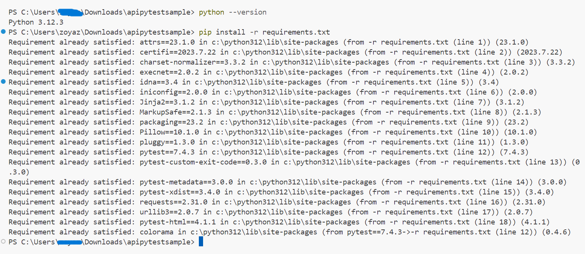

# APIPYTESTSAMPLE => API Automation Solution
#### Test Scenarios Covered => I Considered Get API's fact, facts and breed 

#### PreRequisites
1. python
2. Any IDE of your choice [I used VSCode]

#### Setup
1. Clone Repository from github using command below
    - HTTPS: git clone https://github.com/muneerashaik243/apipytestsample.git
    - SSH : git clone git@github.com:muneerashaik243/apipytestsample.git
    - OR simply download as zip, unzip and go ahead from url : https://github.com/muneerashaik243/apipytestsample
2. Open cloned Repository from vscode/Any IDE
3. open Terminal
4. In Project root directory  example: C:\Users\username\AnyFolder\apipytestsample>
5. Install All Dependencies using command >>> pip install -r requirements.txt>>> All dependencies must be installed here successfully as shown in below screenshot

#### Test Execution Steps
##### In Your Local => In Project root directory  example: C:\Users\username\AnyFolder\apipytestsample>
#### 1. execute tests using  => 
python -m pytest -s --target-env=./config/dev.json --html=report.html --self-contained-html
###### Explanation of test execution command:
###### python -m => By invoking Pytest as a module with python -m, you’re explicitly specifying which Python ###### interpreter to use for running your tests.
###### pytest => command to run tests
###### -s => disable all debugging
###### --target-env=./config/dev.json => passing environmental variable for executing tests based on configuration ###### dev/prod etc
###### --html=report.html --self-contained-html => To generate html self contained Test Report
#### 2. execute tests by passing specific spec file =>
python -m pytest .\test_case\test_cat_fact_multi_environment.py --target-env=./config/dev.json --html=report.html --self-contained-html

#### Test Report
1. Verify HTML Test Execution Report generated in project root directory 
###### C:\Users\username\AnyFolder\apipytestsample>./report.html

